# USER DOCUMENTATION
This documentation is intended for users of the EWU Grants Management application. It will detail everything from logging in through adding proposals and administrative activities.

### TABLE OF CONTENTS
[Logging In](#logging-in)  
[Navigation](#navigation)  
[Dashboard](#dashboard)  
[Viewing Proposals](#viewing-proposals)  
[Searching Proposals](#searching-proposals)  
[Adding Proposals](#adding-proposals)  
[Editing and Deleting Proposals](#editing-and-deleting-proposals)  
[Generating Reports](#generating-reports)  
[Administration](#administration)  
[Logging Out](#logging-out)  

## LOGGING IN
To log into the application you must first have been issued an EWU email address and an existing admin must have added you to the system. Once these steps have been completed, login by following the steps below.

**1. Click on the login button as shown.**

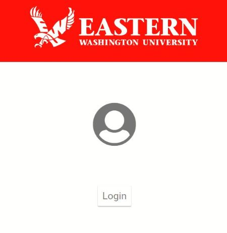

**2. A Google Sign-In box will display on your screen. Enter your EWU email where prompted and click the "Next" button.**

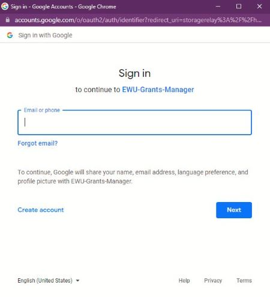

**3. Enter your EWU single-sign-on credentials (these are the same as you use for any other EWU application) and click "Login".**

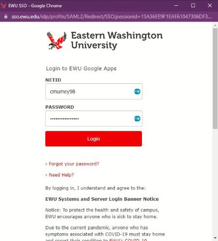

**4. Confirm the account shown is your own and click "Continue".**

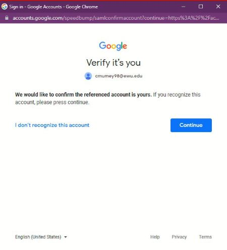

## NAVIGATION
To navigate throughout the application, a navigation bar will be shown at the top of the screen. Click any of the links to be taken to the corresponding page. 

**If you do not have administrative access your navigation bar will look like the screen capture below:**

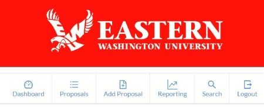

**Otherwise you will have a navigation bar as shown here:**

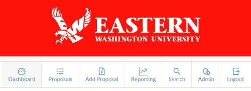

## DASHBOARD
**The dashboard provides a snapshot of the fiscal year details.**

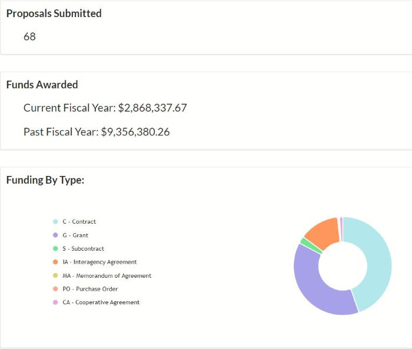

* The "Proposals Submitted" box will show the total number of proposals submitted during the current fiscal year.
* The "Funds Awarded" box will show the dollar amount for all proposals that have been marked as either "Funded" or "Additional" during both the current fiscal year and the previous fiscal year.
* The pie chart will show the percentage of current fiscal year funds awarded for each funding type (the funding types are displayed in the legend to the left of the pie chart).

## VIEWING PROPOSALS
**To view all proposals that have been entered into the system, click on the "Proposals" link of the navigation bar. This will display all proposals from most recent to oldest. You may use the page numbers immediately above the table (as seen in the screen capture below) to move to older proposals.**

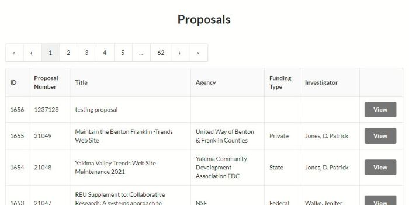

**To view a specific proposal you may click the "View" link that is located in the same row as the proposal you wish to view. You will see a pop-up window display.**

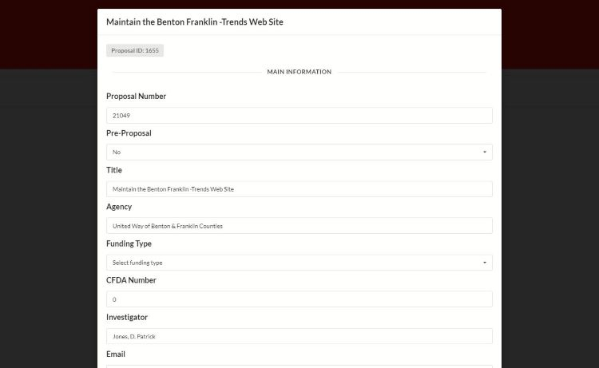

**To edit a proposal, refer to the section on [Editing Proposals](#editing-and-deleting-proposals).**

## SEARCHING PROPOSALS
**To search for one or more proposals move to the "Search" page by clicking the button in the navigation bar. You will see all of the fields as shown below.**

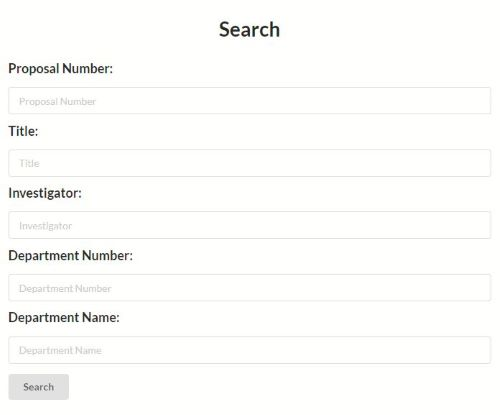

**Enter the identifying information in the field/s and click "Search". If any results are returned from your search you will see a table display. This table functions similarly to the table within the "Proposals" page.**

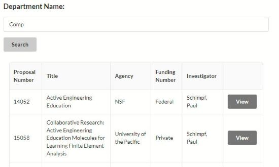

## ADDING PROPOSALS
**To add a new proposal to the system you will navigate to the "Add Proposal" page by clicking the button in the navigation bar. You will see an empty form display.**

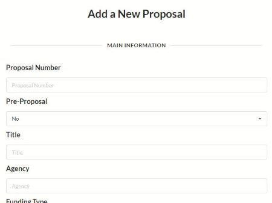

**If you are entering information into one of the large text boxes and find you need more space, click and hold the bottom, right corner (as shown below) and drag to the size you would like.**

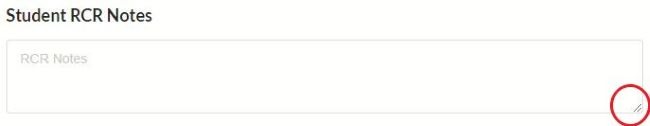

**If the "Pre Award Status" is either "Funded" or "Additional" (or is changed to either at any point)**

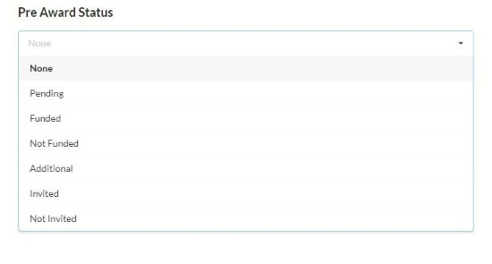

 **the extra sections of the proposal will display. These include the "Award" and "Compliance and Contracting" sections.**

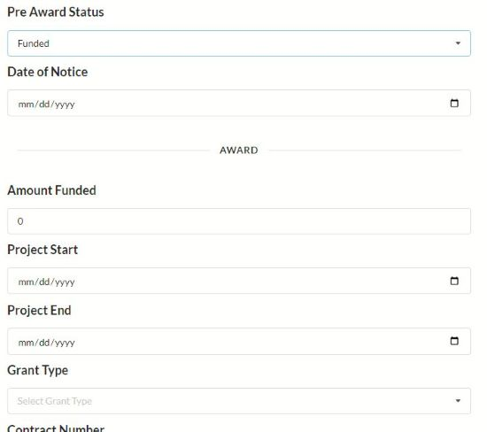

**When you have entered all necessary information into the proposal form click the green "Submit" button as shown below. If you would like to clear all data you may click the "Clear" button or navigate away from the page.**

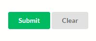

## EDITING AND DELETING PROPOSALS
If you would like to edit a proposal you may use either of the options listed below.

1. Navigate to the "Proposals" page in the application and click on the "View" button that corresponds to the proposal you would like to edit or delete. 

2. Navigate to the "Search" page in the application and search for the proposal you would like to edit or delete. Click on the "View" button that corresponds to that proposal

**Either of these options will display the proposal in the pop up.**

In this window you will make any necessary changes by replacing the existing content in whichever fields need to change. Once that is complete, scroll to the bottom of the screen and click on the green "Update" button. If you would like to discard the changes, click the orange "Cancel" button. You may also delete the proposal entirely by clicking the red "Delete" button.

**NOTE:** Be careful, after you confirm a deletion it is not possible to retrieve the information.

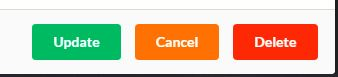

## GENERATING REPORTS

## ADMINISTRATION
If you have been approved as an administrator you will have access to the "Admin" page of the application. This will give you access to all of the functionality detailed below.

### USERS

**You may add a user by entering their first and last name in the "Name" field as well as their EWU email. You may also edit or delete a user by clicking the "Edit" button corresponding to that specific user.**

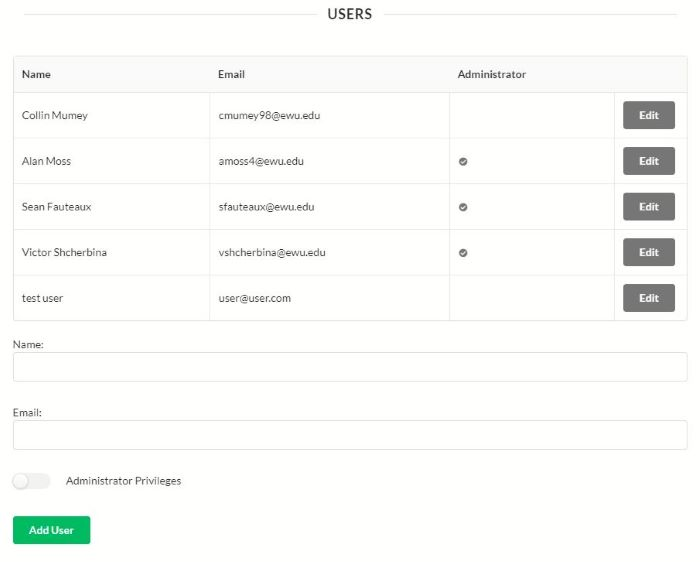

**NOTE:** The email MUST be an EWU email or the user will not be able to login, even if the email has been entered into this system.

### DEPARTMENTS

**You may add a new department by entering the department ID and name. You may also edit the department by clicking on the "Edit" button corresponding to that specific department.**

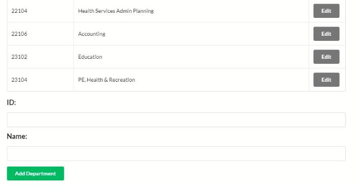

### PERSONS OF CONTACT

**You may add a new person of contact (either pre award or post award) by entering their first and last name. You may also edit the name by clicking on the "Edit" button corresponding to that specific person.**

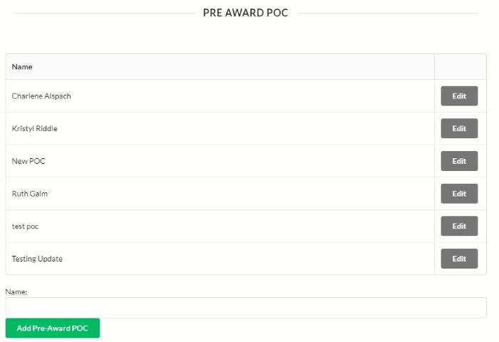

### UNITS

**You may add a new unit by entering the unit name. You may also edit the unit by clicking on the "Edit" button corresponding to that specific unit.**

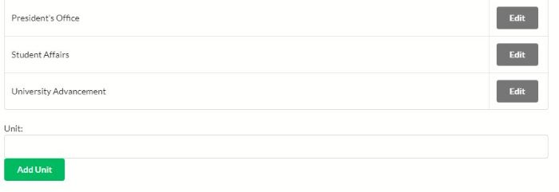

## LOGGING OUT

To log out of the application you may either click the "Logout" link in the navigation bar or simply exit out of the tab or browser window. You will be logged out at this point but there will still be cookies stored in your browser that allow you to automatically log back in by clicking the "Login" button.
